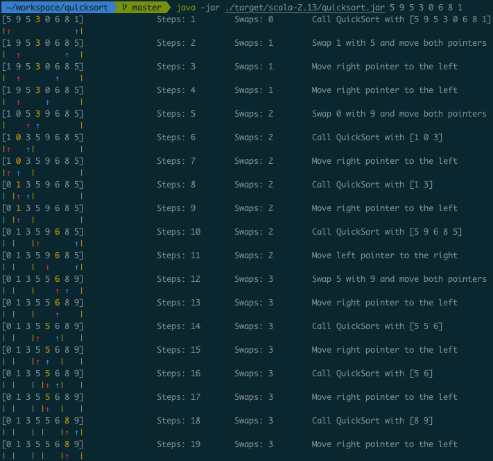

A simple command line tool to visualize, how the Quicksort Hoare partition scheme works.

# How to run it
1. Checkout the repository and navigate with your terminal into the repository directory
2. run `sbt assembly`
3. run `java -jar ./target/scala-2.13/quicksort.jar 5 9 5 3 0 6 8 1`

Note: You can pass any arbitrary list of numbers, but all numbers must be in the range [0,9]!

# Example Output

